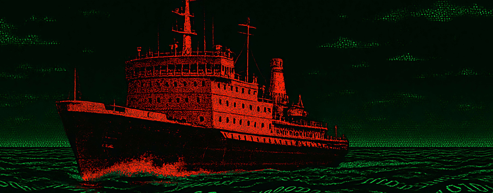

# Once in time we travel through the net
---

  

### About me
- 🌈 [Portifolio](http://cosmic-zip.github.io)
- ❤️ Programming Languages: Rust, R, Python, JavaScript
- 💻 Web Technologies: HTML5, CSS3, Svelte, React Native
- 🚀 Frameworks: Django, FastAPI
- 💾 Databases: PostgreSQL
- 🪙 Blockchain: Solana smart contracts
- 🔮 Business intelligence (BI) development
- ⛓ Cybersecurity best practices
- ⛑ Problem-solving and debugging
- 💪 Team collaboration and communication
- 💸 I'm accept payment in USDT and BNB

###

###

  
  

