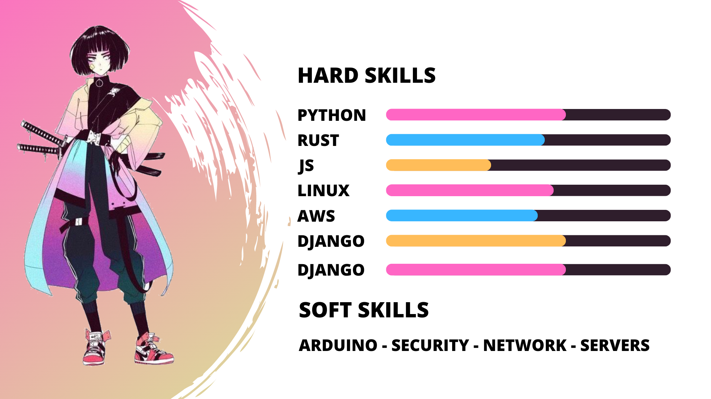

## 👋 Hi there, Welcome to my GitHub! :octocat:

### 

 

### About me
- ₿  Cryptocurrency developer on solana network
- 💻 Full stack software developer python and java-script
- ❤️ Rust developer for linux and backend systems 
- 🕵️ Bug bounty hunter 
- 💳 Cripto payment systems experience
- 💸 I'm accept payment in USDT and BNB
- [Projects](https://github.com/th3maid/projects)

## Github Stats

   
   

## Tecnologias

                           

